## Project Gallery - Brain network analysis
Sean Ma
5/4/2018

### tDCS stimulation sites - Left/Right Lateral Temporal Lobe

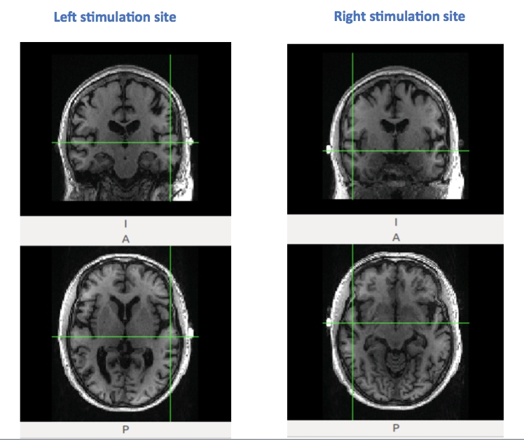

### Resting State – 12 Default Mode Network seeds anlysis

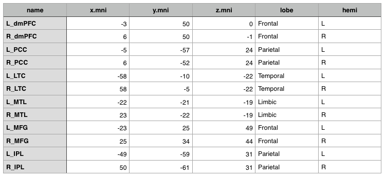

#### Visualization of DMN 12 seeds
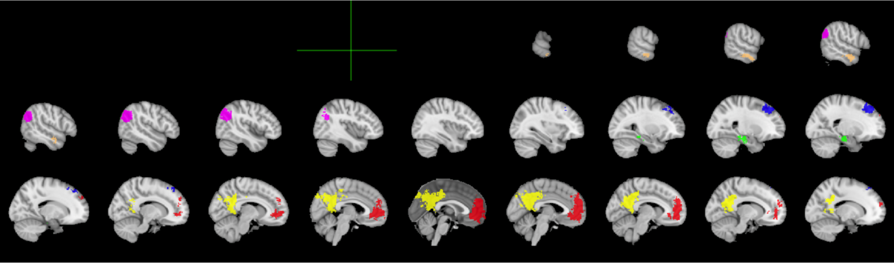

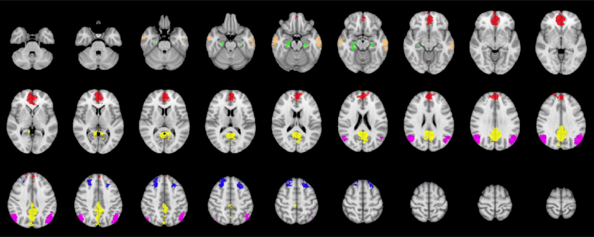

#### Network and edge weight changes after different stimuli sessions
Line width represent edge weight.

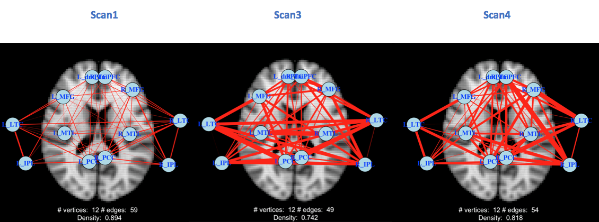

#### Node strength change after different stimuli sessions
Node strength is defined by the summation of edge weights connected to the node.

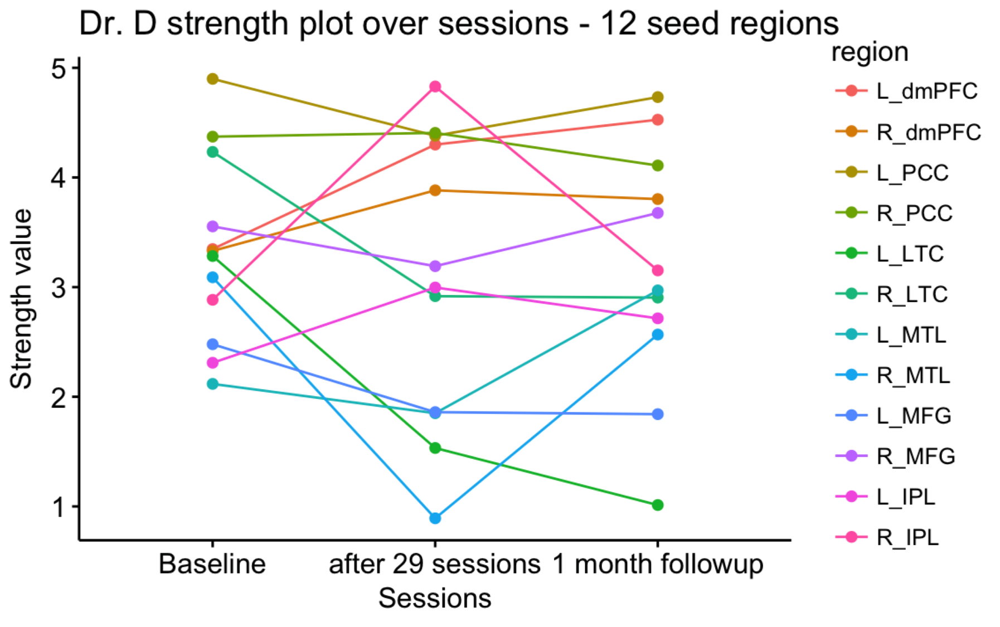

### Resting State – Power 264 + MTL anlysis
Adapting Power 264 nodes with Medial Temporal Lobe regions added.

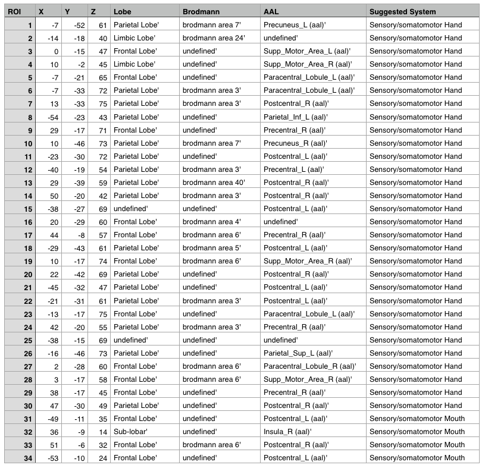

#### Power 264 nodes visualization

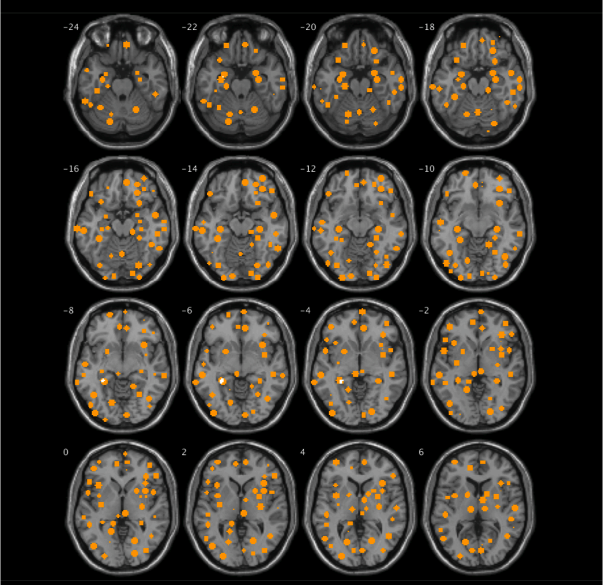

#### Power 264 nodes - strength - violin plot

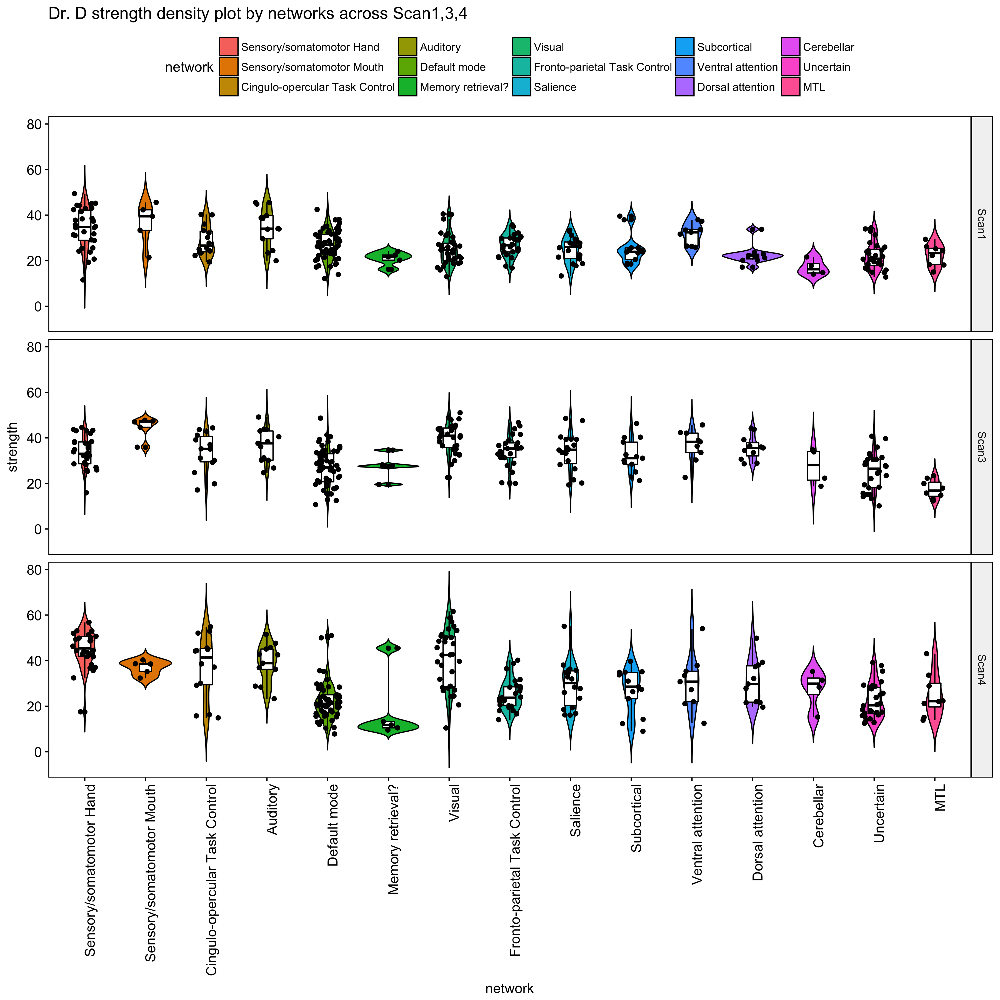

#### Left/Right stimulation sites seed generation - red

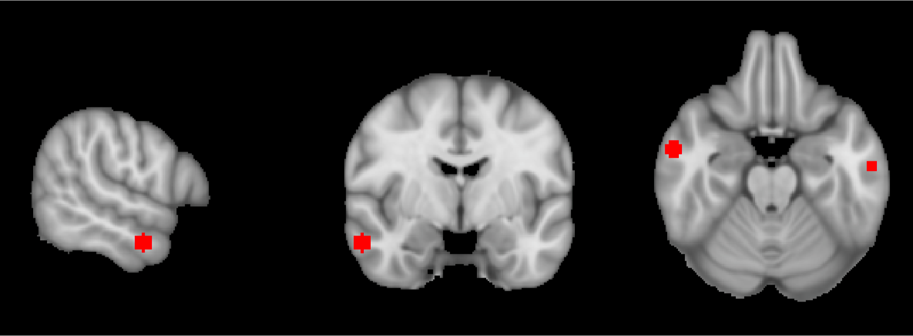

#### 15 seeds from Power 264 nodes closest to Left/Right stimulation sites - green
Selected 15 seeds closest to stimulation sites to understand how direct current is changing the near by brain tissue activities.

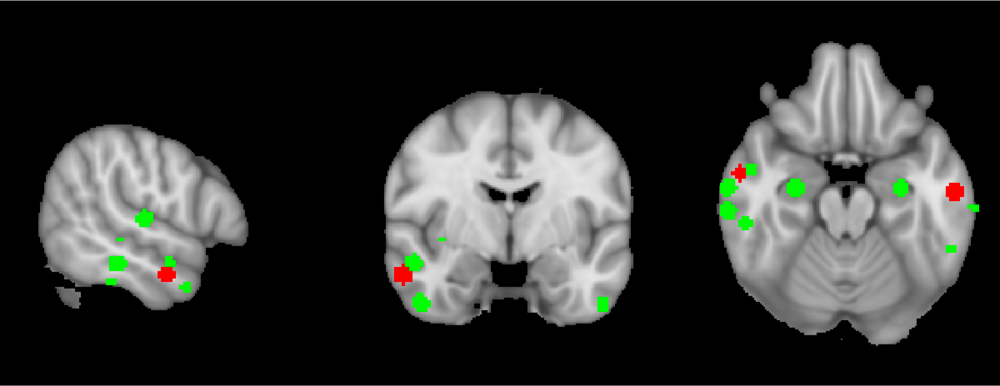

#### 15 seeds strength line plot after different stimuli sessions

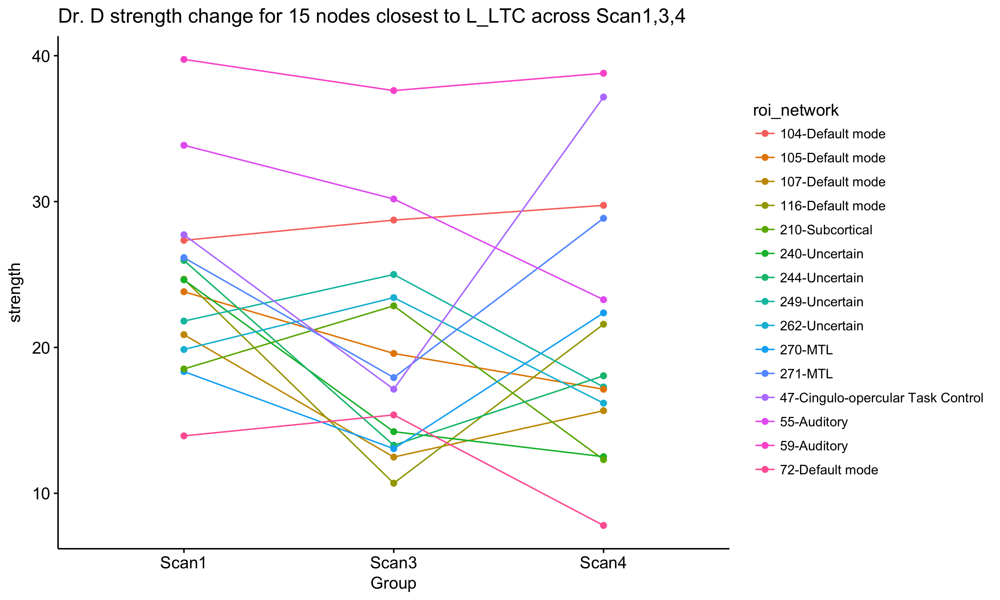

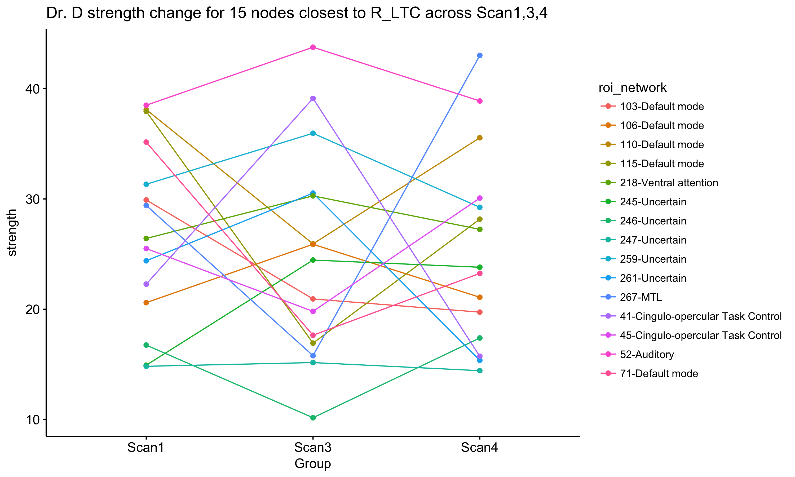
